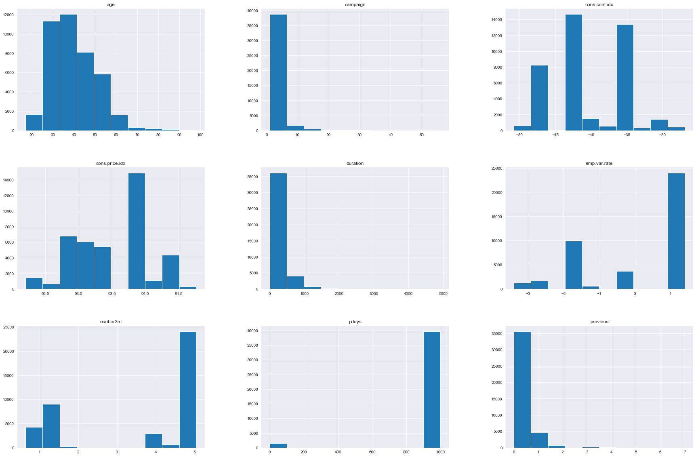
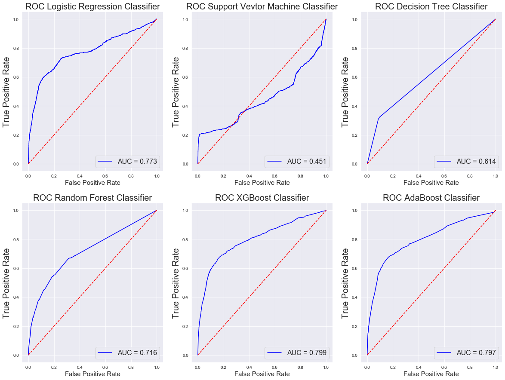

# Bank_marketing
Assessing the success of a direct marketing campaign at a Portuguese Bank

## Retail Bank Marketing Campaign Analysis

When banks, or other companies with a retail presence, create new products, the success of the marketing campaign can make or break the launch.  Being able to use statistical methods to classify the productivity of the marketing campaign will help drive further innovation and be able to efficiently allocate resources for future marketing efforts.

I reviewed the data collected from direct marketing campaigns of a Portuguese banking institution. The method of marketing consisted of customer phone calls. Most potential subscribers required multiple touch points to determine if the customer had subscribed to the featured product.

The product for this focused analysis is a term deposit, a cash investment that is held at a financial instituion at an agreed interest rate for a fixed term (amount of time).

I built a classification model to correctly analyze the binary customer behavior (yes - subscribed or no - did not subscribe).

This project will satisfy the third project requirement for the Data Science Bootcamp at the Flatiron School.

### The Data
The original source data can be found [here](http://archive.ics.uci.edu/ml/datasets/Bank+Marketing#).

Converting the target variable form a 'yes/no' to a \[1,0] leads to the first useful insight: an 11.3% Sucess rate on a phone marketing campaign.  From my knowledge of retail phone sales, this is very reasonable.  A direct phone  marketing approach is worth repeating if a model can identify these 'yes' customers in advance.  Then it's only a matter of making all the calls.

Fortunately for this project, the data was relatively clean and required minimal preprocessing.  This allowed me to jump right into exploration.  I started with a serious of histogram subplots of the variables.  I wanted to identify categorical vs. continuous variables and to see if there existed any data columns that wouldn't work in the analysis.  Most of the variables are clearly not normally distributed, but for the machine learning models I will use later, this doesn't really present a problem.

One of the variables here is not really functional for the analysis.  The column "duration" has an interesting relationship with the target variable. If there were no phone calls (i.e. duration =0) then target, y, __has to be no__. In order to have a more realistic prediction, I dropped this column.

### The Model

Next, I used principal component analysis to pare down the number of variables so that the computing is much more efficient.  In the case of this data set 2 principal componets actually functions almost as well as 15, so I chose to keep it simple.  I setup the model on the full dataset and included the PCA analysis in the pipelines. The data used a 80/20 train/test split. 

I set up piplines that included the PCA and a scaler for 6 different models: Logistic regression, Decision Tree, Random Forest, XGBoost, and AdaBoost. 
 - Logistic Regression pipeline test accuracy: 0.9029
 - SVM pipeline test accuracy: 0.9029
 - Decision Tree pipeline test accuracy: 0.8467
 - Random Forest pipeline test accuracy: 0.8846
 - XGBoost pipeline test accuracy: 0.9025
 - AdaBoost pipeline test accuracy: 0.9011
 - Classifier with best accuracy: Logistic Regression
 
The elbow plots provide a clear visual for the accuracy and behavior of each of these models.  These paint a different picture of the usability of the models.    

To further assess the classifiers, I created confusion matricies and calculated Precision, Recall, and the F-1 Score for each model.  Calculating these metrics manually, trade-offs between minimizing False negatives and minimizing False positives becomes much clearer.
> __Precision__ - True Positive/(True Negative + False Positive) - Measures the ability of the classifier to label a positive sample as a positive sample, not a negative one.

> __Recall__- True Positive / (True Positive + False Negative) - Measures the ability of the classifier to correctly identify all the positive samples.  Represents an inverse relationship to Precision, ie increasing your recall score reduces your precision score and vice versa. 

> __F1-Score__ - 2 * (Precision * Recall)/(Precision + Recall) - Represents the harmonic mean of precision and recall.  Essentially gives the mid-point between increasing balancing recall and precision. 

__Confusion Matrix for Logistic Regression__:
[[7269   58]
 [ 742  169]]
Precision :74.4493%
Recall: 18.551%
F-1: 29.7012%

__Confusion Matrix for SVM__:
[[7269   58]
 [ 742  169]]
Precision :74.4493%
Recall: 18.551%
F-1: 29.7012%

__Confusion Matrix for Decision Tree__:
[[6693  634]
 [ 629  282]]
Precision :30.786%
Recall: 30.955%
F-1: 30.8703%

__Confusion Matrix for Random Forest__:
[[7052  275]
 [ 676  235]]
Precision :46.0784%
Recall: 25.7958%
F-1: 33.0753%

__Confusion Matrix for XGBoost__:
[[7265   62]
 [ 741  170]]
Precision :73.2759%
Recall: 18.6608%
F-1: 29.7463%

__Confusion Matrix for AdaBoost__:
[[7250   77]
 [ 738  173]]
Precision :69.2%
Recall: 18.9901%
F-1: 29.8019%

### Results and Conclusions

So what does this indicate for the classifiers?

A false positive reflects a customer that did not subscribe to the loan program but our model thought it did. False negatives are a customer that did in fact sign up for the loan program but the model incorrectly classified them as non-subscribers.

Which should the business care to minimize? Generally it depends, neither of course are good, but in this case I think a model that had a lower number of false positives is most appropriate. The aim of the model is to define the success of the marketing campaign.  Therefore, accidentally bothering a customer a second time for a loan, is an annoyance.  If instead the bank attributes false success to the campaign they can end up misallocating company resources.

So, in this case the recommendation would be to use the XGBoost Classifier algorithm. This model performed with high or the highest scores in each of the metric categories reviewed.

I have created a model for the managers that 73% of the time can correctly identify if a customer has signed up for a term loan product over the phone without taking into account the effect of the duration of the final touch point.

Should the bank undergo a future marketing campaign with a new customer base, the investment analysis would have a reasonably strong case for their predicted revenues. The model can give a sense of who would actually sign up. 

Additionally, using the XGBoost model has a number of benefits. It was designed as a scalable a gradient boosting algorithm and was developed with the goal of high model performance and computational speeds.

### And if I had more time...

...to continue, I would complete a full analysis on the dataset that includes duration.  I would also address duration for only subscribed customers in a regression analysis to see if I can predict sign-up based on call time.  Finally, I could remove the principal component analysis from the pipeline models to see how computational efficiency weighs against accuracy.

